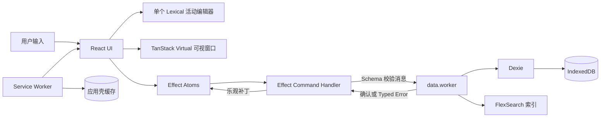

# Flowlist 技术架构

| 项目 | 内容 |
| --- | --- |
| 文档版本 | v1.0 |
| 状态 | MVP 架构基线 |
| 更新日期 | 2026-09-09 |
| 产品依据 | [`PRD.md`](PRD.md) v1.1 |
| 选型调研 | [`docs/research/editor-library-selection.md`](docs/research/editor-library-selection.md) |

## 1. 架构目标

Flowlist 采用纯前端、本地优先的单页 PWA。架构首先保证日常热路径不随整棵树大小线性变慢：

- 100,000 节点、50 MB 本地数据下，1 秒内恢复首屏并可编辑；
- 输入 P95 ≤16 ms；
- 新增、删除、移动 P95 ≤50 ms；
- 异步保存确认 P95 ≤200 ms；
- 搜索 P95 ≤100 ms；
- 桌面、平板和手机共用一份代码；
- Chrome/Edge 桌面端与 Safari iOS 是发布必测平台。

这些指标是发布门禁。任何库的宣传或通用 benchmark 都不能替代 Flowlist 的固定数据集实测。

## 2. 非目标

MVP 架构不包含服务端、SSR、账号、云同步、多人协作、CRDT、事件溯源、插件系统或多存储后端。应用只维护一份当前状态；未来需求出现前不为同步预留协议层。

## 3. 技术栈

| 职责 | 选择 | 使用边界 |
| --- | --- | --- |
| 构建与 UI | TypeScript、React、Vite | React 只管理视图和当前可见缓存 |
| Effect 运行时 | `effect@4.0.0-rc.112`、`@effect/atom-react` | 领域命令、Schema、Typed Error、Worker 客户端和细粒度订阅。一切领域逻辑、状态、异步与校验必须走 Effect；唯一例外是纯 JSX 渲染层：React 组件不得出现 `Effect.run*`，只通过 atom 订阅消费状态。选 Effect 的首要动机是 LLM 友好：类型化程序自带文档、显式错误通道和清晰测试边界，便于 agent 生成正确代码。完整决策与边界理由见 [ADR-0001](docs/adr/0001-effect-runtime-and-hard-boundary.md) |
| 富文本 | Lexical | 全局只保留一个活动编辑器实例；静态行不挂载编辑器 |
| 虚拟列表 | `@tanstack/react-virtual` | 只渲染可视行和少量 overscan，动态测量行高 |
| 本地数据库 | Dexie + IndexedDB | 节点级增量事务；不序列化整棵树 |
| 搜索 | FlexSearch | 在数据 Worker 中维护 Document 索引，启用 CJK encoder |
| 拖拽 | Atlassian Pragmatic Drag and Drop | 只绑定当前可见行；节点菜单提供非指针替代操作 |
| 排序键 | `fractional-indexing` | 移动时生成相邻键，不批量重写同级节点 |
| PWA | `vite-plugin-pwa` + Workbox | 预缓存应用壳；新版本由用户确认后激活 |
| 测试 | Vitest、fast-check、Playwright | 领域不变量、真实浏览器流程和性能门禁 |

依赖必须提交 `pnpm-lock.yaml`。`effect@rc` 锁定精确版本；其他依赖锁定已验证版本，升级必须重跑编辑器、数据迁移和性能回归。

选择 Lexical 的完整依据见 [编辑器选型调研](docs/research/editor-library-selection.md)。官方资料确认其 React 绑定、JSON 状态、Markdown 转换和历史能力；但没有官方证据证明本项目的 100k/50MB 目标，因此必须通过第 14 节的原型门禁。

## 4. 系统拓扑



只有三个状态所有者：

1. **IndexedDB**：节点与大纲元数据的持久化事实来源（UI 偏好如主题存于 localStorage，不属于大纲数据）。
2. **`data.worker`**：数据库连接、父子索引、搜索索引和后台清理的唯一所有者。
3. **主线程 atoms**：当前焦点、可视节点缓存、选区、保存状态和会话撤销栈。

Lexical 只拥有当前活动标题或备注的编辑状态，不拥有整棵大纲。Service Worker 只缓存静态应用资源，不接触用户数据。

## 5. 模块边界

| 模块 | 责任 | 不负责 |
| --- | --- | --- |
| `domain` | `Node`、`Command`、补丁、不变量和 Effect Schema | React、Dexie、DOM |
| `state` | atoms、可视缓存、乐观更新、保存状态、100 步撤销栈 | 持久化和全文索引 |
| `outline` | 虚拟列表、行渲染、焦点、选择、键盘和面包屑 | 数据库调用 |
| `editor` | 单 Lexical 实例、静态富文本渲染、Markdown 转换 | 树结构变更 |
| `data.worker` | Dexie、FlexSearch、父子映射、事务、迁移、导入导出和清理 | React 和用户提示 |
| `worker-client` | 原生 `postMessage`、请求关联、超时、Schema 校验和 Typed Error | 领域决策 |
| `pwa` | manifest、应用壳缓存、离线和更新提示 | 节点数据 |

MVP 不增加 repository interface、通用 event bus 或第二套 Worker RPC 框架。Worker 协议直接使用原生 `postMessage`；不采用 `effect/unstable/rpc`。

## 6. 数据模型

### 6.1 持久化节点

```ts
type NodeRecord = {
  id: string
  parentId: string
  orderKey: string
  type: "bullet" | "h1" | "h2" | "h3" | "paragraph" | "todo" | "quote" | "code" | "divider"
  title: SerializedEditorState
  note?: SerializedEditorState
  titleText: string
  noteText: string
  completed: boolean
  collapsed: boolean
  revision: number
  createdAt: number
  updatedAt: number
  tombstonedAt?: number
}
```

- `id` 使用原生 `crypto.randomUUID()`；排序由 `orderKey` 决定，无需可排序 ID 依赖。
- `parentId + orderKey` 表达树与顺序。移动子树只更新根节点这两个字段，后代不改写。
- `title` 和 `note` 的 Lexical JSON 是富文本事实来源。
- `titleText` 和 `noteText` 在同一命令中派生，供静态显示降级、搜索和标签识别使用。
- `#标签`、`@标签` 和 `YYYY-MM-DD` 从纯文本派生，不存独立实体。
- `revision` 防止延迟的保存确认覆盖更新状态，不用于多人协作。
- `tombstonedAt` 让大子树删除成为单行写入；后代在撤销窗口结束后后台回收。

### 6.2 IndexedDB 表

| 表 | 主键/索引 | 内容 |
| --- | --- | --- |
| `nodes` | `id`、`[parentId+orderKey]`、`parentId`、`updatedAt`、`tombstonedAt` | 节点当前状态 |
| `meta` | `key` | `schemaVersion`、最近焦点、索引版本和迁移状态 |
| `searchChunks` | `key` | FlexSearch 导出分片；可丢弃并从 `nodes` 重建 |

Dexie schema migration 必须在单个版本事务内完成。节点表是权威数据；搜索分片损坏或版本不匹配时直接删除并后台重建。

### 6.3 JSON 备份

无损备份包含 `formatVersion`、导出时间和全部非 tombstone 节点。导入流程先完成文件大小检查、JSON 解析、Effect Schema 校验、ID 唯一性、父节点存在性、无环和排序键合法性，再在单个 Dexie 事务中替换数据。任何步骤失败都保留原数据库。

导入是破坏性整库替换且不可撤销（撤销栈在导入成功时清空）：导入确认框必须明确提示“将替换当前全部数据”，并提供“先导出当前数据”的快捷按钮，用户可跳过提醒直接导入；MVP 不做自动快照。

Markdown 是可读交换格式，不是权威存储格式。下划线允许降级；JSON 必须无损往返。导出文件名固定为 `flowlist-backup-YYYYMMDD-HHmmss.json`（本地时间）；MVP 不提供大纲命名，根视图固定显示“全部大纲”。

ID 语义：库内复制粘贴时，粘贴的每个节点（含子树所有后代）分配新 `id` 与新 `orderKey`，`createdAt`/`updatedAt` 刷新；JSON 导入是整库原子替换而非合并，保留文件中的原 `id`，校验只针对文件内部唯一性。复制到剪贴板的中间格式为带 `formatVersion` 的项目 JSON，纯文本降级为 Markdown。

## 7. Worker 协议与调度

主线程和 `data.worker` 使用带 `requestId` 的判别联合消息。所有请求和响应在边界用 Effect Schema 校验。

核心请求只有：

- `OpenView`：返回焦点路径、可见总数和首屏节点；
- `LoadRange`：按虚拟窗口范围返回节点；
- `ApplyPatch`：原子写入新增、编辑、移动、折叠、完成或 tombstone；
- `Search`：返回当前焦点分支内的节点 ID 和匹配信息；
- `Export` / `Import`：无损备份与恢复；
- `Compact`：清理已离开撤销窗口的 tombstone 子树。

Worker 队列顺序是：保存与读取 > 用户搜索 > 后台索引导入/重建与清理。后台工作分块并主动让出事件循环；搜索请求带递增序号，旧结果到达后直接丢弃。

若实测搜索或索引重建使保存 P95 超过 200 ms，才将 FlexSearch 拆到第二个 Worker。MVP 不预先维护两套跨 Worker 一致性协议。

## 8. 启动流程

1. Service Worker 从缓存加载应用壳。
2. 主线程尝试取得 `flowlist-writer` Web Lock，并启动 `data.worker`。
3. Worker 打开 Dexie、完成必要迁移，读取最近焦点和首屏范围。
4. UI 渲染首屏、挂载单个活动编辑器并允许输入；此时必须满足 ≤1s。
5. Worker 在后台加载父子元数据并导入已持久化的 FlexSearch 索引。
6. 索引不可用时搜索框显示“正在建立索引”；其他编辑功能不等待。
7. 索引版本不匹配时从 `nodes` 分块重建，完成后替换 `searchChunks`。

启动不读取或渲染全部富文本 JSON。只有当前焦点路径、首屏和虚拟窗口邻近节点进入主线程缓存。

## 9. 变更热路径

所有用户修改都经过一个 Effect `CommandHandler`。命令先验证不变量并产生 `{forward, inverse}` 最小补丁，再乐观更新 atoms，最后异步发送给 Worker。

| 操作 | 主线程立即执行 | Worker 持久化 | 复杂度目标 |
| --- | --- | --- | --- |
| 新增 | 生成 UUID 与相邻 `orderKey`，插入可视索引 | 新增一行并更新搜索索引 | 不扫描整棵树 |
| 编辑 | Lexical 保持输入；100ms 内合并为节点补丁 | 更新单行富文本、纯文本和 revision | 不序列化整棵树 |
| 移动 | 从可视索引移除并插入目标位置 | 只更新子树根的 `parentId + orderKey` | 后代零写入 |
| 删除 | 从可视索引隐藏根和可见后代 | 只写根节点 `tombstonedAt` | 大子树即时返回 |
| 完成/折叠 | 更新对应节点 atom | 更新单行 | O(1) 数据写入 |
| 撤销/重做 | 应用 inverse/forward 补丁 | 与普通命令相同 | 最近 100 步 |

Worker 在提交前再次校验目标父节点不是当前节点或其后代。主线程校验负责即时反馈，Worker 校验负责数据完整性。

### 9.1 保存失败

UI 继续保留乐观内容，但把全局状态设为 `unsaved`，展示持续可见提示，并保留失败补丁供重试或 JSON 导出。失败不能伪装为成功，也不自动回滚用户刚输入的内容。

保存失败按错误类型分级处理：

- 瞬时错误（事务冲突、Worker 忙）：失败补丁与新补丁照常入队，自动重试，指数退避 1s→2s→4s→8s→16s，上限 5 次（约 31 秒）；用户无感知；
- 配额或持久错误（`StorageQuotaError`、重试 5 次仍失败）：停止静默重试，UI 升级为显眼提示并引导立即 JSON 导出（导出走 Worker 内存，不依赖 IndexedDB 写入，是配额错误下唯一的抢救通道）；
- 所有情况下都不自动清空、不自动回滚、不降级到其他存储；导出、继续编辑、刷新由用户决定。

结构操作立即发送；连续文字输入按节点合并，最迟 100ms 发送，在 `compositionend`、失焦和页面进入后台时立即 flush。进程被强制终止时，理论最大未持久化窗口为 100ms。

### 9.2 排序键

使用 `fractional-indexing` 的 `generateKeyBetween` 处理新增和移动，批量粘贴使用 `generateNKeysBetween`。只有排序键超过经 benchmark 确定的长度阈值时，Worker 才在空闲期重排该组同级节点。

### 9.3 删除与垃圾回收

删除命令仅 tombstone 子树根。撤销清除 tombstone；导出、搜索和可视遍历忽略 tombstone 根及后代。物理回收的唯一判据是“产生 tombstone 的命令不在当前撤销栈中”（无论因栈深滚动、栈清空还是会话结束而离开），不存在时间窗口：正常运行时该判据满足即在空闲期分块回收，应用异常退出留下的 tombstone 由下次启动的空闲期兜底回收。

## 10. 富文本与大纲交互

### 10.1 单活动编辑器

- 应用生命周期内只创建一个 Lexical editor instance。
- 未编辑的可见节点用静态 React renderer 展示 Lexical JSON，不创建 `contenteditable`。
- 激活标题或备注时，将活动 host 放入目标行并载入该字段的 EditorState。
- 切换节点前先 flush 当前内容；虚拟列表不得卸载仍处于 composition 的活动行。
- 静态 renderer 直接遍历受 Schema 验证的 Lexical JSON，不使用未经清理的 `dangerouslySetInnerHTML`。

这一设计把 Lexical 的工作量限制为一个小文档；10 万节点压力由虚拟列表和数据 Worker 承担。

### 10.2 内容能力

按需注册 Lexical 模块，仅覆盖：

- 粗体、斜体、下划线、删除线、行内代码和链接；
- H1/H2/H3、段落、待办、引用、代码块和分隔线；
- 标题与 `Shift + Enter` 备注；
- Markdown 快捷输入、粘贴、复制和可读导出。

Lexical 内置 Markdown transformer 不覆盖下划线。JSON 保留该格式；Markdown 导出降级为纯文本，不定义私有 Markdown 方言。

### 10.3 撤销与重做

应用撤销栈统一记录内容和结构补丁。文字输入在 composition、选择变化和短暂停顿边界合并；每条内容补丁只保存一个字段的前后 EditorState 和会话选区。`Cmd/Ctrl + Z`、`Cmd/Ctrl + Shift + Z` 由应用命令处理，防止单 Lexical 实例跨节点串联历史。

栈的边界规则：

- 保存失败与撤销正交：撤销优先于重试，撤销已失败的补丁后，重试队列同步丢弃该条，不允许同一份补丁同时悬挂在两处；
- 撤销栈清空时机仅限：刷新（会话结束）、导入成功、接管写入权、存储配额失败后用户选择导出重置；
- 一个批量操作（多选移动/缩进/删除/复制、大批量粘贴）在栈中只占一步。

撤销采用混合粒度：活动编辑器内、且应用栈顶不是该节点的未提交补丁时，撤销走 Lexical 原生字符级历史；一旦该节点补丁提交进应用栈（失焦、切换节点或结构操作），Lexical 历史对该节点即告作废，后续撤销走应用栈。原型门禁必须覆盖两个历史交接处的边界用例。

### 10.4 多行粘贴

第一行插入当前光标；后续行根据 Tab、空格或 Markdown 列表缩进生成节点。标题、待办、引用和代码块映射为节点类型。解析错误返回原始纯文本，不能静默丢弃内容。大批量粘贴形成一个可撤销命令并使用一次 Dexie 事务。

## 11. 展示、导航与拖拽

### 11.1 虚拟树

Worker 维护父子映射；主线程只持有当前焦点分支的可视 ID 窗口。每个虚拟项包含 `id`、`depth`、估算高度和稳定 key。TanStack Virtual 根据实测高度修正位置；展开、折叠和移动只更新受影响的可视区段。

焦点使用原生 History API 写入 `#/node/{id}`。每次聚焦都 `pushState`，不做去重或合并；面包屑、浏览器前进/后退和刷新共享同一导航状态，不引入 React Router。历史导航（前进/后退/刷新）不是“操作”：不进撤销栈，也不清空撤销栈。

### 11.2 拖拽

Pragmatic Drag and Drop 只绑定当前挂载的虚拟行。命中区支持“之前、之后、作为子节点”，边缘触发自动滚动；拖动完整子树时预览只展示根节点和子节点数量，不克隆整棵子树。

键盘和辅助技术用户通过节点菜单执行上移、下移、缩进和减缩进，不实现额外的键盘拖拽模式。iOS 触摸、Safari 拖拽预览、动态行高和虚拟滚动必须在原型中实测。

### 11.4 备注

- 有备注的行显示固定尺寸的备注指示器，点击或 Shift+Enter 展开；无备注的行无指示器；
- 同一时刻至多一行备注处于展开态，展开的备注属于该行内部临时状态；
- 行高只有标准行高与展开行高两种，展开行由备注实际内容决定动态高度，其余行全部固定；
- 搜索命中备注时，结果行临时展开备注并高亮匹配段，清除搜索后还原；
- Enter 在备注内换行（备注是唯一允许内部换行的字段）；Shift+Enter 在标题中进入备注，在备注中回到标题。

### 11.5 多选交互

- 桌面：Ctrl/Cmd+点击离散追加，Shift+点击范围选择，Shift+↑/↓ 键盘扩展，Cmd/Ctrl+A 选当前层全部；
- 移动端：长按（约 500ms 且未移动超过阈值）进入选择模式，之后点选追加，长按第二个节点扩展范围；
- 长按与拖拽共用同一根手指：手指移动超过阈值即进入拖拽，不再回到选择模式；按住超时且未移动则触发选择并取消本次拖拽。阈值以真机验收为准；
- 不做常驻复选框列；
- 多选状态下拖动任一选中节点即整体拖动选中集合；选区内含折叠节点时，批量操作作用于折叠子树根（子树整体算一个单位），不递归展开；
- 一个批量操作在撤销栈中占一步。

### 11.3 标签与日期

静态纯文本派生器识别 `#标签`、`@标签` 和合法日期 `YYYY-MM-DD`（分隔符接受 `-`、`/`、`.`）。标签与日期没有独立实体和专属查询语法，能被搜到仅因为它们是文本；点击识别结果即将其文本填入搜索框。识别结果仅用于装饰和搜索；原始富文本始终保留。MVP 不引入自然语言日期库、时区推断或提醒调度。

## 12. 搜索

FlexSearch Document index 存储节点 ID，并索引 `titleText`、`noteText`、标签和日期。启用 CJK encoder；每次已提交或未保存的节点补丁都增量更新索引，使搜索结果与当前界面一致。

查询在输入停止 120ms 后发送；防抖计时器启动时立即 flush 当前活动编辑器的未提交补丁（只保证送达 Worker，不等待事务提交），使用户刚输入的内容在下一次搜索请求发出前已进入索引。Worker 先取得候选，再利用内存中的 `parentId` 映射过滤当前焦点分支和 tombstone 后代，最后返回有限结果及祖先路径。搜索结果引用原节点 ID，不复制内容。

搜索索引是可重建缓存：

- 正常退出和后台空闲时分片导出到 `searchChunks`；
- 节点 revision 或索引版本不一致时标记 dirty；
- dirty 索引不覆盖权威节点数据，并在后台重建；
- 索引构建期间不阻止编辑、保存和导航。

## 13. 多标签页、离线与更新

### 13.1 单写入标签页

启动时通过 `navigator.locks` 请求 `flowlist-writer`：

- 获得锁的标签页可编辑；
- 其他标签页完全只读：不挂载活动编辑器，不提供任何可编辑入口；搜索、聚焦、滚动、展开折叠、导出照常可用。无锁标签页零写入：折叠等纯展示状态仅在内存中生效，不落库；接管入口是横幅上的显式“在此标签页接管”按钮，不通过首次输入隐式触发；
- 只读标签页通过 `BroadcastChannel` 接收“数据已变化”通知；
- 用户点击“在此标签页接管”后，当前写入页先 flush、释放锁，新页面再取得锁并刷新缓存；
- 页面崩溃或关闭后浏览器自动释放锁。

不实现多写入合并、最后写入胜出或 CRDT。

### 13.2 PWA 与离线

Workbox 只预缓存带内容哈希的应用壳、manifest、图标和必要字体。节点数据始终来自 IndexedDB，网络状态不参与保存成功判断。

Service Worker 在后台下载新版本，但不自动 `skipWaiting` 并刷新页面。只有 Worker 确认没有待保存补丁后，UI 才提示用户重新加载。更新提示的具体行为：

- 提示永不自动消失，但去干扰化：首次以横幅出现，用户忽略后缩为角落小圆点，可随时点开；
- 用户忽略提示后继续编辑完全安全：新补丁照常保存到当前 SW 控制的页面与 IndexedDB，SW 版本与数据库 schema 迁移无关；新版本激活后的 Dexie 迁移必须兼容读取上一版本数据（只前进不破坏），此兼容性纳入迁移测试；
- 新 SW 仅在用户点击“重新加载”时激活（页面重载时浏览器自动激活 waiting SW）；不做任何形式的自动激活。

数据库迁移失败时保留旧事务数据并报告错误。

## 14. 性能验证与发布门禁

### 14.1 固定数据集

测试数据由确定性 seed 生成，包含：

- 100,000 个节点；
- 50 MB 标题、备注和 Lexical JSON；
- 深树、宽树、折叠树、完成项、标签、日期和 tombstone；
- 中文、英文、emoji、长文本、链接和代码块。

定量配比（深度分布、节点类型、富文本占比等）以签入仓库的 seed 常量文件为准，作为 fixture 契约的一部分记录在测试代码中；数值在原型阶段用真实使用感受校准一次后冻结，此后任何改动必须重跑全部性能门禁。该 fixture 只存在于测试代码，不进入生产 bundle。

### 14.2 指标

| 场景 | 门禁 |
| --- | --- |
| 已缓存启动到首屏可编辑 | ≤1s |
| 连续输入 | P95 ≤16ms |
| 新增、普通删除、移动 | P95 ≤50ms |
| 大子树逻辑删除或移动 | P95 ≤50ms |
| 保存确认 | P95 ≤200ms |
| 搜索 | P95 ≤100ms |
| DOM 规模 | 与可视行和 overscan 成正比，不随 100k 节点增长 |

Playwright 运行启动、输入、新增、删除、移动、保存、搜索、离线和恢复流程，使用 Performance API 采集 P50/P95。所有门禁均为绝对值，不使用相对基线：日常 CI 单会话判定，每型操作至少 50 个样本（不足则循环执行）；发布前在约定的 4 核/8 GB 桌面设备和真实 iOS Safari 上各运行 30 次并做全样本聚合 P95 判定。

### 14.3 富文本原型门禁

实现其他功能前先完成一个 vertical slice：Dexie 中生成 100k/50MB 数据，TanStack Virtual 展示静态节点，一个 Lexical 实例在节点间切换，并完成中文 IME、备注、Markdown、撤销、滚动和保存。

以下任一失败都阻止继续铺开功能：

- 创建了与节点数成比例的 editor 或 `contenteditable`；
- iOS Safari 或中文 composition 丢字、跳光标或异常滚动；
- 切换节点后 undo 作用到错误节点；
- 静态展示和活动编辑器布局明显跳变；
- 任一核心性能指标超过门禁。

Lexical 的 100k/50MB 表现当前为 **unverified**，只有该原型通过后才视为架构成立。

## 15. 测试策略

### 15.1 Vitest

- 命令的 forward/inverse 补丁；
- Markdown 与 Lexical JSON fixture 往返；
- 标签、日期和纯文本派生；
- Worker Schema、迁移、导入校验和 Typed Error；
- tombstone 清理与搜索索引 dirty/rebuild。

### 15.2 fast-check

随机生成新增、编辑、缩进、减缩进、移动、删除、撤销和重做序列，持续验证：

- 无环；
- 每个非根节点只有一个有效父节点；
- 同一父节点下 `orderKey` 唯一且严格有序；
- tombstone 后代不可见；
- command + inverse 恢复原状态；
- JSON 导出再导入保持可见数据等价。

### 15.3 Playwright 与真实设备

- IndexedDB 持久化、配额/事务失败、刷新和离线；
- 单写入标签页、接管和 PWA 更新；
- 键盘、触摸、拖拽替代菜单和焦点恢复；
- 10 万节点性能流程；
- Chromium 自动化，WebKit 作为近似回归；真实 Safari iOS 负责 IME、触摸、拖拽和安装最终验收。

## 16. 错误与数据安全

Effect Typed Error 至少区分：`ValidationError`、`ReadOnlyError`、`StorageQuotaError`、`StorageTransactionError`、`MigrationError`、`ImportError` 和 `WorkerUnavailableError`。UI 按错误类型给出可恢复动作，不显示成功形状的默认值。

安全边界：

- JSON/Markdown 导入在 Worker 边界校验，超出产品支持规模时拒绝并保留原数据；
- 链接只允许明确支持的协议，新窗口使用 `noopener`；
- 富文本不执行脚本、不直接注入未清理 HTML；
- MVP 不做应用层加密，不声称浏览器本地数据等同加密备份；
- 不接入远程遥测，性能数据仅用于本地和 CI 验证。

## 17. 实施顺序

1. **性能原型**：100k/50MB、Dexie、TanStack Virtual、单 Lexical、IME 和指标采集。
2. **数据闭环**：Schema、Worker 协议、节点事务、fractional order、保存失败和 100 步撤销。
3. **核心编辑**：大纲键盘、备注、富文本、静态 renderer、聚焦和面包屑。
4. **查找与移动**：FlexSearch、标签/日期、多选、拖拽和节点菜单。
5. **数据安全**：tombstone 清理、JSON 导入导出、单写入锁和迁移测试。
6. **PWA 发布**：离线应用壳、更新提示、响应式、无障碍和真实设备门禁。

前一步的性能或数据完整性门禁未通过时，不开始下一步。

## 18. 升级触发条件

| 当前选择 | 只在以下条件出现时升级 |
| --- | --- |
| 单 `data.worker` | 搜索/重建导致保存 P95 >200ms |
| effect rc | 4.x stable 发布且全部回归门禁通过后升级；若 rc 出现阻断性缺陷且 stable 遥遥无期，降级路径是将 Worker 边界校验换成独立 Schema 库并退回普通 TS 错误类，替换范围限于 `domain`、`state`、`worker-client` 三模块 |
| Dexie + IndexedDB | 实测超过约 500k 节点、需要复杂聚合查询，或事务吞吐持续不达标 |
| 当前状态 + 会话撤销 | 云同步或持久版本历史进入已排期需求 |
| 单 Lexical 实例 | 原型证明切换成本高于多实例池，且内存仍满足目标 |
| 节点级多选 | 跨节点字符选择成为明确 P0 需求 |
| `-`/`/`/`.` 三种分隔符的日期识别 | 自然语言日期、提醒或日历进入已排期需求 |
| 导入前导出提醒（无自动快照） | 可用性测试发现误导入频发，或用户要求导入可撤销 |

## 19. 参考资料

- [Effect 官方仓库](https://github.com/Effect-TS/effect)
- [Lexical 官方仓库](https://github.com/facebook/lexical)
- [TanStack Virtual 官方文档](https://tanstack.com/virtual/latest)
- [Dexie 官方文档](https://dexie.org/docs/Dexie/Dexie)
- [FlexSearch 官方仓库](https://github.com/nextapps-de/flexsearch)
- [Pragmatic Drag and Drop 官方仓库](https://github.com/atlassian/pragmatic-drag-and-drop)
- [`fractional-indexing` 官方仓库](https://github.com/rocicorp/fractional-indexing)
- [`vite-plugin-pwa` 官方文档](https://vite-pwa-org.netlify.app/)
- [MDN Web Workers](https://developer.mozilla.org/en-US/docs/Web/API/Web_Workers_API)
- [MDN Web Locks API](https://developer.mozilla.org/en-US/docs/Web/API/Web_Locks_API)
- [MDN Broadcast Channel API](https://developer.mozilla.org/en-US/docs/Web/API/Broadcast_Channel_API)
